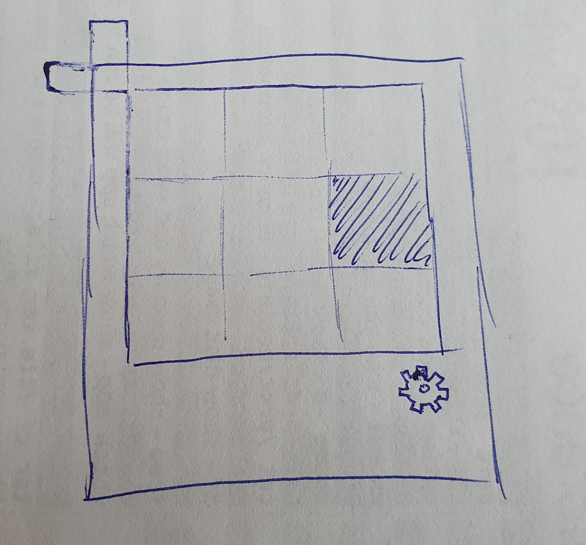
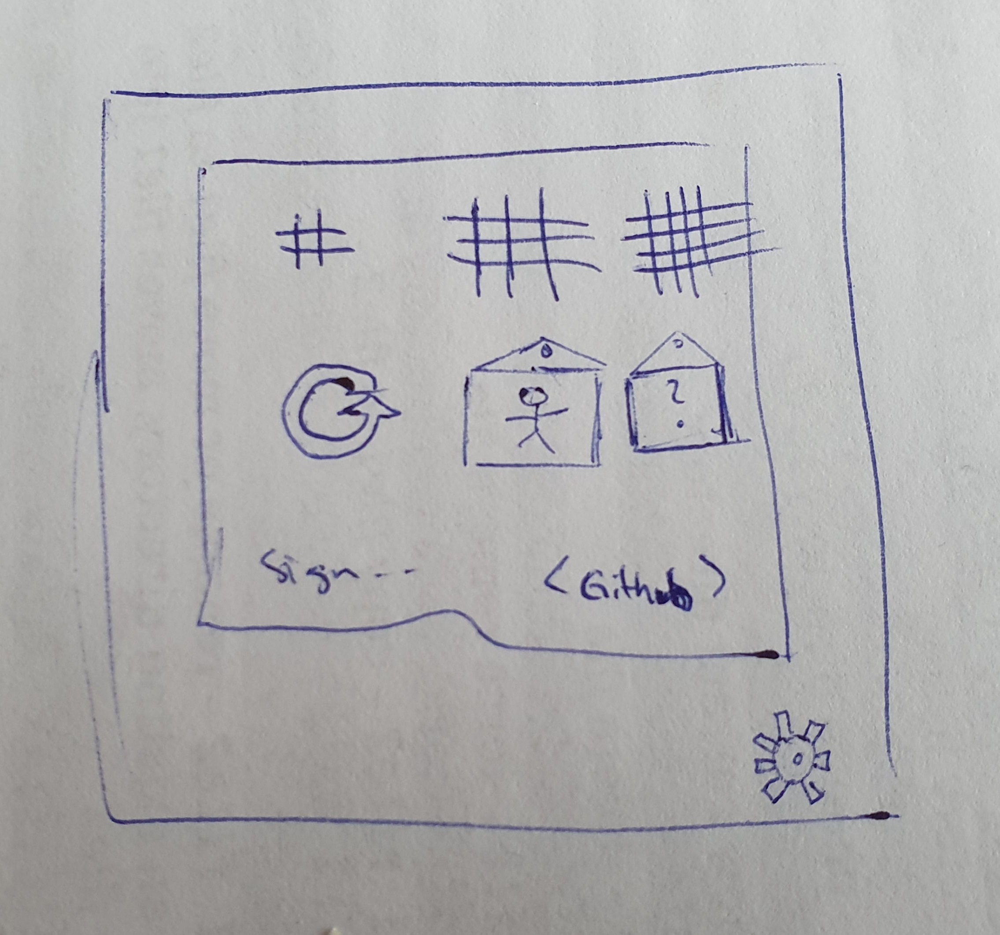
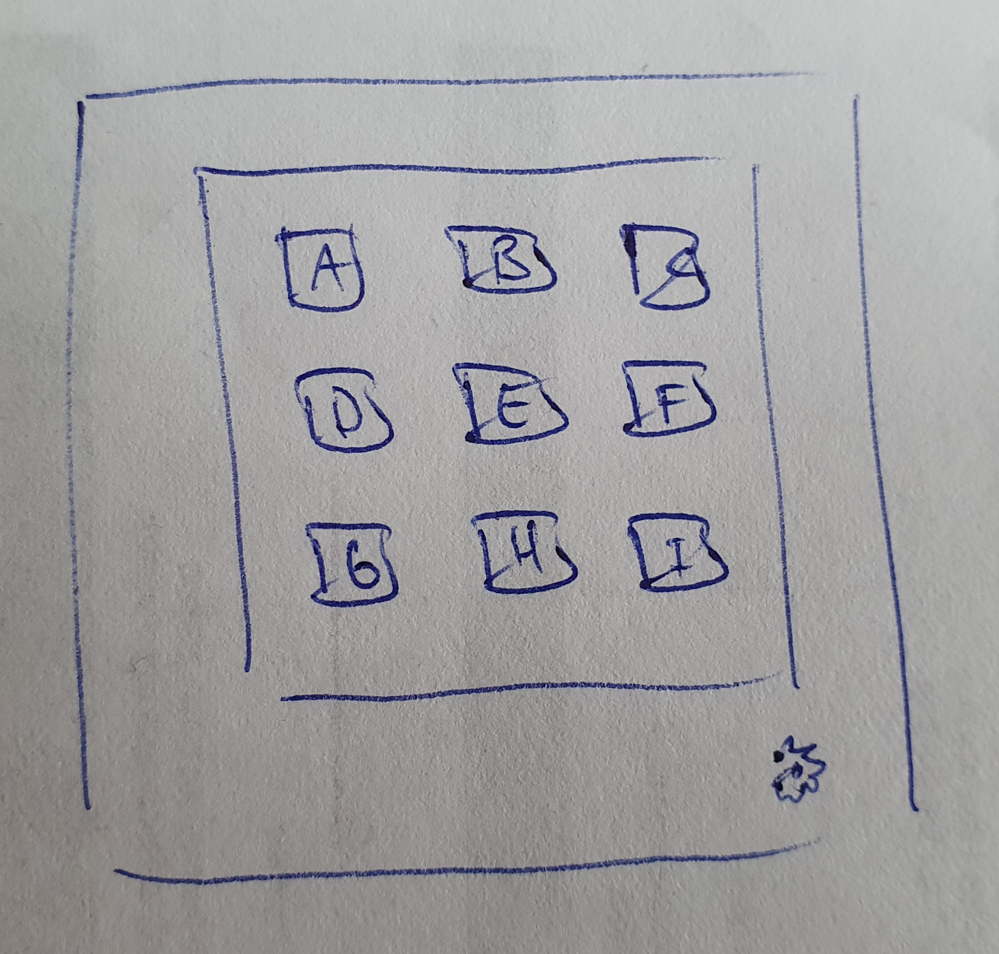
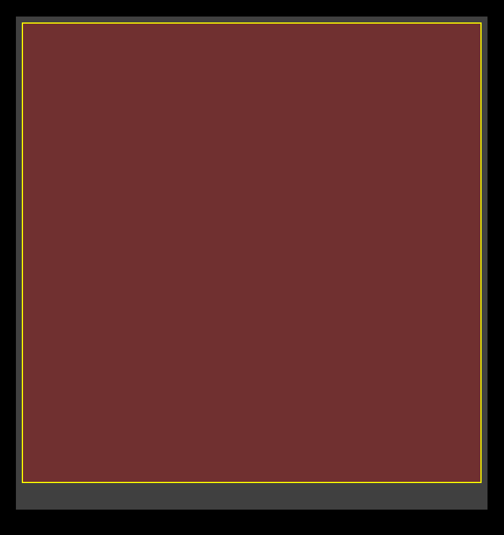
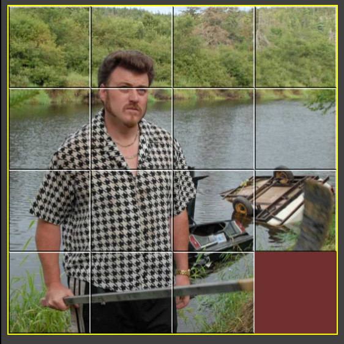

# Slide puzzle

Sliding tile puzzle (devtober 2021)

# Devtober log

## October 1st

### Ideas

Discovering devtober and thinking about what to make.


## October 2nd

### Decision

Deciding on making a sliding tile puzzle game for mobile and desktop using HTML, CSS and vanilla JavaScript.


## October 3rd

### Features

I want to implement the following features:

- Responsive layout, working on all types of screens
- Playable on desktop and mobile
- Scramble the puzzle
- Click a tile to move into free space
- Tile click moves several tiles if along the same path
- Press arrow keys to move a tile to the free space
- Complete: remove tile grid and display full image. Transition.
- Options button below board. Click toggles options panel
- Option to restart puzzle
- Option to restart with random image
- Option to select tile grid (4x4, 5x5, 6x6..) restarts the game
- SVG icons/symbols 
- Option to select image from predefined list
- Drag-drop image
- Select image from mobile gallery or file upload
- Link to github
- Count moves (on off)
- Timed game (on off)

### Design

Quick and dirty design sketches.



A bit of padding on the sides. Board + icon to toggle options. Maybe a signature/logo on the lower left.



Options layer. Select grid size, restart, select image, random image, signature, link to GitHub. Add more icons along the way. (EDIT: I think I'll move the signature out of the options overlay)



Select image dialog. Select from some predefined images


## October 4th

### Master plan

Making a list of what to do and in what order. More tasks might be added throughout the process, the order might be changed. This list will be updated to reflect the process. 

    v init github project
    v set up codebase, define objects, definitions, ..
    v create responsive layout with current grid size
    v runtime css where needed
    v build tile markup, assign background image
        v css class coordinates to align image
        v image must cover all tiles in grid
        v all image ratios must work, not just 1:1
    v grid on top of tiles (before/after)
    v scramble board n times. Don't repeat last step.
    v space tile in upper left corner after scramble
    - click tile handler
    - keypress arrow
    - move tile. 100% increments. update left top on element
    - move multiple tiles along the same path
    - move with transition
    - check if finished. fade out grid. show full image.
    - options toggle. svg icon. semitransparent layer
    - background image as base64 string?
        - only if custom image. runtime-image style section + state flag
    - options pane with icons
    - select new game grid
        - restart game
        - recalc sizes
        - reset runtime css
        - keep current image
    - grid icons 4x4 5x5 6x6 ..
    - restart game (icon). keep image
    - random image, restart
    - drag-drop, restart
    - upload image, restart
    - create google/facebook meta tags. remember correct image ratio
    - upload game to server
    - link to github
    - add process description + screenshots ++ to readme.md

### Init GitHub project

Hello, I just created this readme file and a folder for screenshots. Let's go!

### Codebase

Setting up the codebase, based on experience from the games I've made recently.
conf defines the different grids available, and the default (starting) grid. Conf also defines the white space on either side of the board. This is needed to calculate the correct board and layout size in the next step.

### Responsive layout

`fullscreen` takes the entire screen. The size and position of `ratio` is calculated based on `state.grid` (the current grid size), `conf.hSpace` and `conf.vSpace`.

The board flows inside the ratio container. I calculate the width and height of the board and set is as a runtime style. Another approach would be to use padding-bottom as ratio for the board, but in this case the browser renders the board slightly higher than the width. This is because I have box-sizing: content-box and a 2px border on the element. With a tile size of 100px, the board is 404x408 when using that technique.



Yuuuup, just like that. Gray area is ratio wrapper. Red area is board with 2px border.

## October 5th

### runtime css

It's convenient to update a style section instead of assigning styles to every DOM element. This is done for each screen resize, and everythime the grid changes.

### Tile markup and background images

Generating tiles based on the selected grid size (state.grid) and positioning them inside the tiles container. The size of the tiles container is one tile, thus making positioning of the tiles easy and responsive, in 100% increments.

The background image is slightly more tricky.
each tile has a div that is the size of the entire board, and positioned differently based on the initial coordinate. The tile has the background image covered. This works with 100% increments. No need to calculate based on grid size. We can have predefined css classes that set the correct position of the inner div.

```
.tiles {
    li {
        &.x0 div { left: 0; }
        &.x1 div { left: -100%; }
        &.x2 div { left: -200%; }
        &.x3 div { left: -300%; }
        &.x4 div { left: -400%; }
        &.x5 div { left: -500%; }
        &.y0 div { top: 0; }
        &.y1 div { top: -100%; }
        &.y2 div { top: -200%; }
        &.y3 div { top: -300%; }
        &.y4 div { top: -400%; }
        &.y5 div { top: -500%; }
    }
}
```


### grid borders

Using the before-element on each tile to set a shiny 2px border.



I'll deal with the color palette later :-P

## October 6th
## October 7th
## October 8th
## October 9th

To sum up.. the different tiles show the correct image fragment. All this is handled by setting the appropriate coordinate css classes on each tile.

I need to keep track of each tile's position throughout the game. A 2-dimensional array with coordinates should to the trick. That way I only need to check query the internal structure instead of checking the DOM.
The array board.tiles represents each coordinate of the board. Each element of the array has `{ x: <int>, y: <int> }` where the values reflect the intended coordinate. The game is solved only if all array coordinates correspond to the coordinates in the value. Poor explanation.

## October 10th

Having generated the tile array, it needs to be shuffled before we can generate the html. First, I create the function for generating the tiles, to be able to test the shuffle properly

Shuffling the board without repeating the last step, and starting with the free space on the top left corner. For this I need a fast way of knowing where the space is. board.space{x,y} will hold this coordinate.

Whenever a tile is clicked, it is moved in the direction of the free space, as long as the free space is on the same horizontal or vertical axis. The markup for the tiles will be generated whenever the grid changes. Any event handlers attached must then be re-attached. I don't want that. Maybe it's better to promote the click event to one of the parent containers, and only take action if a tile is clicked. The board container seems like a good candidate.

The click event gives us e.clientX and e.clientY, which makes it possible to calculate which tile coordinate is clicked. This coordinate is relative to the upper left corner of the viewport, so it needs to be translated intro something useful.


## October 11th
## October 12th
## October 13th
## October 14th
## October 15th
## October 16th
## October 17th
## October 18th
## October 19th
## October 20th
## October 21st
## October 22nd
## October 23rd
## October 24th
## October 25th
## October 26th
## October 27th
## October 28th
## October 29th
## October 30th
## October 31st
