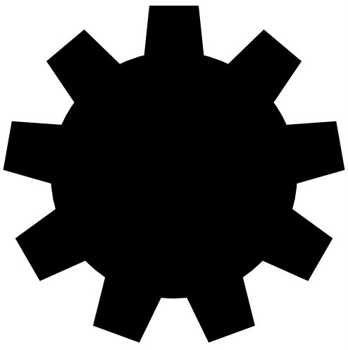

# Sliding tile puzzle (devtober 2021)

https://lysebo.xyz/games/slidepuzzle


Solve the puzzle by clicking on a tile and moving it into the free space. Keyboard navigation is possible with the arrow keys. Click the animated gear to reveal/hide options.

The options are:
- select grid (3x3, 4x4 or 5x5 tiles)
- restart game (keeping the current picture)
- shuffle game (select a random picture)
- upload image (jpg, png, gif) or take a picture (mobile)

On desktop you can even drag-drop a custom image onto the game.

Uploaded images are not stored anywhere. They are only visible in your browser as long as you play the game.


# Thoughts about devtober

This game was developed during October 2021, inspired by the devtober initiative (https://itch.io/jam/devtober-2021). It was a fun experience, and really satisfying to complete the goal on time.

Working towards a deadline is useful. The beauty of a spare-time project is having the time to experiment and perfecting the details. The trick is to find the right balance between the two, prefereably with more fun than frustration. The time limit was perhaps a bit too narrow for me this time. Or perhaps the project was a bit too ambitious?

Devtober suggest coding a little every day. My ambition is to get a fair amount done every week. The point is really to have an ongoing process. On days without coding I sometimes think and plan and dream of the next steps, keeping my brain occupied with good stuff.

Prior to this, it's been many months without a real gamedev project. Devtober has kickstarted this routine again. Thanks, devtober!


# TODOs

The time is up. However, possible further development of this game should include the following features:

- On desktop, it should be possible to show/hide the options and navigate through the different buttons with the keyboard.

- When uploading an image, there should be a process indicator.

- All magic numbers should originate from a config object.

- The functions should have more comments


# Devtober log

Following is a small log of the development process.

## October 1st

Eek, I just discovered devtober and need to think about what to make!

## October 2nd

Finally deciding on making a sliding tile puzzle game for mobile and desktop using HTML, CSS and vanilla JavaScript.

## October 3rd

I want to implement the following features:

- Responsive layout, working on all types of screens
- Playable on desktop and mobile
- Scramble the puzzle
- Click a tile to move it into free space
- Tile click moves several tiles if along the same path
- Press arrow keys to move a tile to the free space
- Complete: remove tile grid and display full image. Transition.
- Options button below board. Click toggles options panel
- Option to restart puzzle
- Option to restart with random image
- Option to select tile grid (4x4, 5x5, 6x6..) restarts the game
- SVG icons/symbols 
- Option to select image from predefined list
- Drag-drop image
- Select image from mobile gallery or file upload
- Link to github
- Count moves (on off)
- Timed game (on off)


Starting with some quick and dirty design sketches.


A bit of padding on the sides. Board + icon to toggle options. Maybe a signature/logo on the lower left.


Options layer. Select grid size, restart, select image, random image, signature, link to GitHub. Add more icons along the way. (EDIT: I think I'll move the signature out of the options overlay)


Select image dialog. Select from some predefined images

## October 4th

Making a master plan of what to do and in what order. More tasks might be added throughout the process. This list will be updated to reflect the process.

    v init github project
    v set up codebase, define objects, definitions, ..
    v create responsive layout with current grid size
    v runtime css where needed
    v build tile markup, assign background image
        v css class coordinates to align image
        v image must cover all tiles in grid
        v all image ratios must work, not just 1:1
    v grid on top of tiles (before/after)
    v scramble board n times. Don't repeat last step.
    v space tile in upper left corner after scramble
    v click tile handler
    v move tile. 100% increments. update left top on element
    v move multiple tiles along the same path
    v move with transition
    v state.busy when tiles transition
    v keypress arrow
    v touch handler
    v check if finished
    v finished: fade out grid. show full image.
    v options toggle. svg icon. semitransparent layer
    v options pane with icons
    v grid icons 4x4 5x5 6x6 ..
    v select new game grid
        v restart game
        v recalc sizes
        v reset runtime css
        v keep current image
    v restart game (icon). keep image. keep grid
    v shuffle image
        v svg shuffle icon
        v add misc pictures
        v set random image
        v restart game
    v refactor options
    v drag-drop, restart
    v custom image overrides predefined image
    v upload image, restart
    v background image as base64 string?
        v only if custom image. runtime-image style section + state flag
    v mobile: take photo
    v link to github
    v create google/facebook meta tags. remember correct image ratio
    v upload game to server
    v add process description + screenshots ++ to readme.md

Let's go!

Setting up the codebase, based on experience from the games I've made recently. Identifying the different objects I want to use, somewhat organized by purpose. Such as `conf{}` wich holds all configurable "magic numbers" in the game. For instance the default starting grid (4, meaning a 4x4 grid).

The outer DOM elements `.fullscreen` and `.ratio` have some reset/normalize CSS rules applied to them, to avoid otherwise helpful browser features (such as pull-down to refresh). Features that are only annoying in a game context. The size and position of `ratio` is calculated based on `state.grid` (the current grid size) and different space values defined in `conf{}`.

The board flows inside the ratio container. On each screen resize, the width and height of the board are calculated. The values are set in a runtime style element on the page.

I ensure that each tile in the grid has an absolute integer value. Avoiding percentages, to reduce the possibility of glitches and inaccuracies caused by the different browsers rounding functions.


Yuuuup, just like that. Gray area is ratio wrapper. Red area is board with 2px border.

## October 5th

Expanding the runtime css section. I think it's both convenient and tidy to update a style section instead of (re-)assigning styles to every DOM element that has changed. This is done for each screen resize, and everytime the grid changes.

Generating tiles based on the selected grid size in `state.grid` and positioning them inside the tiles container. The size of the tiles container is one tile, thus making positioning of the tiles easy and responsive, in 100% increments.

The background image is slightly more tricky. Each tile has a div that is the size of the entire board, and positioned differently based on the initial coordinate. The div has the background image covered. The positioning is also solved with 100% increments. No need to calculate based on grid size. We can have predefined css classes that set the correct position of the inner div.

```
.tiles {
    li {
        &.x0 div { left: 0; }
        &.x1 div { left: -100%; }
        &.x2 div { left: -200%; }
        &.x3 div { left: -300%; }
        &.x4 div { left: -400%; }
        &.x5 div { left: -500%; }
        &.y0 div { top: 0; }
        &.y1 div { top: -100%; }
        &.y2 div { top: -200%; }
        &.y3 div { top: -300%; }
        &.y4 div { top: -400%; }
        &.y5 div { top: -500%; }
    }
}
```

or rather

```
@for $i from 0 through 7 {
    &.x#{$i} div { left: #{$i * -100%}; }
    &.y#{$i} div { top: #{$i * -100%}; }
}
```

Using the before-element on each tile to set a shiny 2px border.


I'll deal with the color palette later :-P

## October 6th - 8th

## October 9th

I need to keep track of each tile's position throughout the game. A 2-dimensional array with coordinates should to the trick. That way I only need to check the internal structure instead of checking the DOM.

The array `board.tiles` represents each coordinate of the board. Each element of the array has `{ x: <int>, y: <int> }` where the values reflect the intended coordinate. The game is solved only if all array coordinates correspond to the coordinates in the value. Poor explanation.

## October 10th

Having generated the tile array, it needs to be shuffled before we can generate the html. First, I create the function for generating the tiles, to be able to test the shuffle properly.

Shuffling the board without repeating the last step, and starting with the free space on the top left corner. For this I need a fast way of knowing where the space is. `board.space{x,y}` will hold this coordinate.

Whenever a tile is clicked, it is moved in the direction of the free space, as long as the free space is on the same horizontal or vertical axis. The markup for the tiles will be generated whenever the grid changes. Any event handlers attached must then be re-attached. I don't want that! Maybe it's better to promote the click event to one of the parent containers, and only take action if a tile is clicked. The board container seems like a good candidate.

The click event gives us `e.clientX` and `e.clientY`, which makes it easy to calculate which tile coordinate is clicked. This coordinate is relative to the upper left corner of the viewport, so it needs to be translated into something useful. Getting help from `state.ratioLeft` and `state.ratioTop` which are already being maintained upon each screen resize.

A tile can only be moved if it lays on the same axis as the free space. So we need to find that out first. Move tiles to free space until we've reached the clicked position.

Adding a 0.2s transition on left + top and achieving the gamification badge! :-p

## October 11th - 15th

## October 16th

I am confused by my own code, and need to refactor things related to building the tiles, and maintaining the state of the board.

`board.tiles[y][x]` gives info about the tile currently in that position. tile has `{ ox: <int>, oy: <int> }` describing where the tile belongs. I also need the element, so I don't have to search the DOM every time the user click a tile. Adding it to each coordinate.

Before moving tiles, `state.busy` must be `true`. After the tiles have finished moving, `state.busy` is set to `false` again. This prevents the user from moving tiles off the board.

## October 17th

Refactor of transitionEnd event handler and `state.busy`.

## October 18th

Adding more events to move the tiles. keypress, touchstart

Check if puzzle is complete.
- check if finished
- fade out grid
- show full image

## October 19th - 22nd

## October 23rd

Creating a gear SVG to serve as an options toggle icon. I have reserved 30px for the height of the gear. So how does a poor boy construct the perfect gear symbol? Drawing some examples to find the proper form. Using the same knob path and rotating it 9 times around the origo. Using a mask to get a transparent center. Nice! I love SVG!





creating a section for options. clicking on the gear toggles the visibility. When the section is visible, `state.gameOn` is `true`, disabling all game related interactions.

Being hung up on SVGs I might start with creating icons for changing grids. 3, 4, 5, 6, 7 tiles in either direction. Background color is green for the easiest grid and red for the hardest grid. Up next is to reset the grid, and reset the game, when the user clicks a grid.

## October 24th

Clicking on a grid option resets the game, keeping the current image.

Creating a restart icon. Clicking on it resets the current game, keeping the grid and image.

Creating a shuffle icon and ading it to the options pane. Adding more images, assigning them to different board classes (i0, i1, i2, ...) and creating `conf.numImages` (int) so the random function knows what to do.

## October 25th - 29th

## October 30th

The options section is annoying and not user friendly at all! I'm going to put the icons to the left of the gear, and let the gear toggle the visibility. Now the user can choose to have the options always visible or not. Adding a transition on opacity when toggling the visibility. Smooth AF!

Now, for the drag-drop.
Adding class `droppable` to the parent container. When the user drags an image over the page, the background color should respond to that.
Dropping the image, we must set it on the appropriate containers, and remove the default image class. Selecting a custom image, `state.customImage` must be set to false again.

Implementing file upload. So happy to see that mobile users can choose between pictures and camera! That's nice! The upload procedure is exactly the same as for drag-drop.

## October 31st

Last day!

Saying farewell to the yellow border. Also chosing a color for the free space tile.

Refactored upload processes.

Added a proper upload/camera SVG icon

Stole the github icon and put it among the options.

Added more images

Added google/fb metatags + preview image.

I made it! :-D

